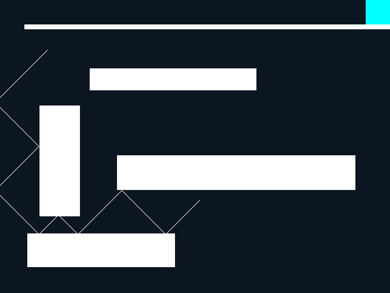

# StreakOfLight~一筋の光~

## Siv3D Game Jam - 第 16 回 | テーマ「光」 - の作品

### 製作者
[まこと](https://twitter.com/language_43)

### 使ったもの
* Visual Stuio 2015 update3
* Siv3D August 2016 v2

### どんなゲームよ！？
* 右上の青い場所に光を誘導するゲーム
* マウスで矩形を作り反射をコントロール！？

### 操作方法
* ドラッグ&ドロップで矩形を作成
* spaceで矩形を消去(デバグ用で使ってたけどあってもいいかなーと)

## 注意
実際にゲームをしていると矩形に潜り込むバグが残っています。(取りきれなかった)  
矩形の頂点に光が移動してくると起こります。   
spaceを押して矩形を消去すると普通どおりに戻るので！  

変なゲームって楽しんで貰えれば嬉しいです

